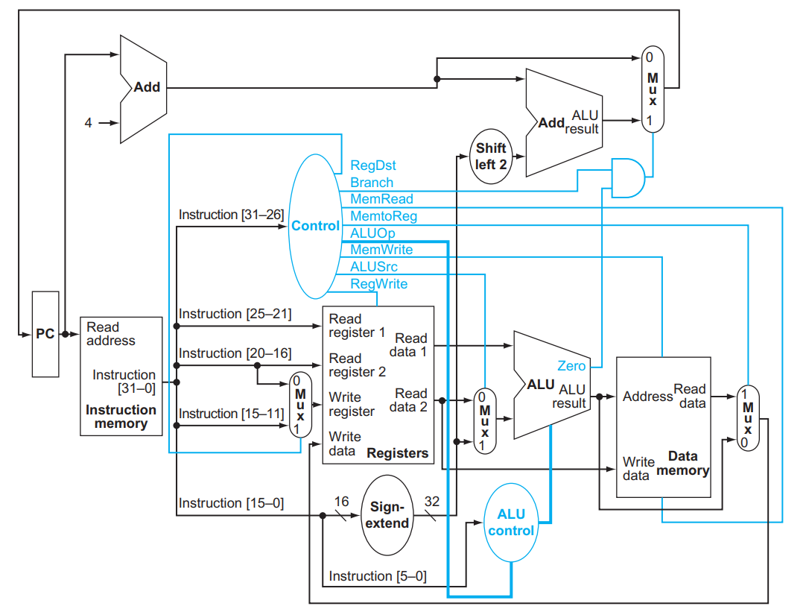

# CS220-Mini-MIPS-Processor

This project implements a Mini MIPS Processor in Verilog. It includes modules for instruction fetch, decode, execution, memory access, and write-back stages. The processor supports a subset of MIPS instructions, including R-type, I-type, and branching operations.

## Key Components
- **Instruction Memory**: Stores and fetches instructions ([Instruction_Memory.v](Instruction_Memory.v)).
- **Registers**: Handles register read/write operations ([Registers.v](Registers.v)).
- **ALU**: Executes arithmetic and logical operations ([ALU.v](ALU.v)).
- **Data Memory**: Handles memory read/write ([Data_Memory.v](Data_Memory.v)).
- **Program Counter**: Updates the instruction address ([PC.v](PC.v), [PC_update.v](PC_update.v)).

## Simulation
- Testbench: [main_tb.v](main_tb.v)
- Assembly to Machine Code Conversion: [Assembler.py](Assembler.py)

## Usage
1. Write assembly instructions in `assembly.txt`.
2. Use `Assembler.py` to generate `machine_code.txt`.
3. Simulate the processor using the testbench.

## Reference
We have written the code and made connections taking the below image as our reference.
